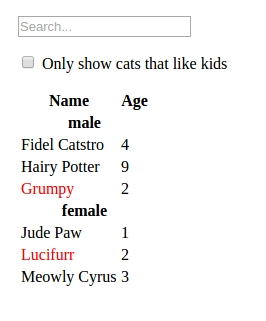

# Cat Shelter App

## Description:

A basic app for a cat shelter used to show and filter all the cats in a shelter.

## Technologies:
- HTML5
- CSS
- SASS
- JavaScript
- React
- Webpack

## Installation:
-  ```git clone https://strelicja.github.io/Cat_Shelter_App/``` to clone the repository
- ```npm install``` to install all dependencies
- ```npm start``` to preview the app

## Preview: 
Check the preview of the website here: https://cenora6.github.io/Cat_Shelter_App/
