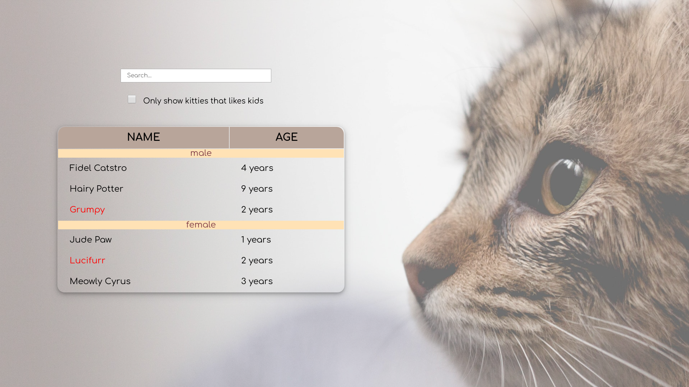

# Cat Shelter App

## Description:
A basic app for a cat shelter used to show and filter all the cats in a shelter. 
The application lets you:
- search cat based on their age and sex
- find all cats who like children
- search for the cat's name

## Live Demo
[Cat Shelter App - Live Preview](https://cenora6.github.io/Cat_Shelter_App/)

## Technologies and additional dependencies:

| Tool | Description |
| :-------------:|--------------|
| HTML5 | A markup language used for structuring, and presenting content on the World Wide Web. |
| [SASS](https://www.npmjs.com/package/sass/) | A preprocessor scripting language that is interpreted or compiled into CSS.  |
| [React](https://www.npmjs.com/package/react/) | A JavaScript library for creating user interfaces. |
| [Webpack](https://www.npmjs.com/package/webpack) | Packs CommonJs/AMD modules for the browser. Allows to split your codebase into multiple bundles, which can be loaded on demand.  |

## Installation:
[node.js](http://nodejs.org/download/) is required to use ``npm``.

-  ```git clone https://github.com/Cenora6/Cat_Shelter_App.git/``` to clone the repository
- ```npm install``` to install all dependencies
- ```npm start``` to preview the app
